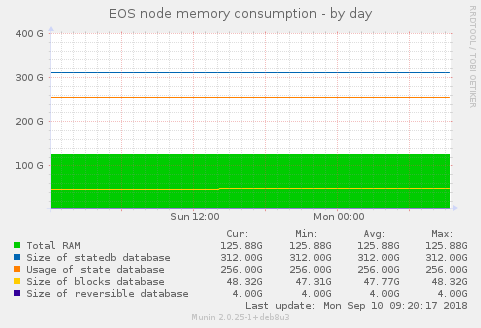

# eos-munin-plugin

### Munin plugin to monitor EOS node (state db, blocks db) memory consumption

##### Configuration:
echo "[eosmem*]

env.DATADIR /opt/EOSmainNet
" >> greetings.txt

where DATADIR path to your nodeos catalog with blocks and state catlogs

##### Usage: 
just place plugin in /usr/share/munin/plugins/eosmem_

$ chmod 755 /usr/share/munin/plugins/eosmem

$ ln -s /usr/share/munin/plugins/eosmem /etc/munin/plugins/eosmem

