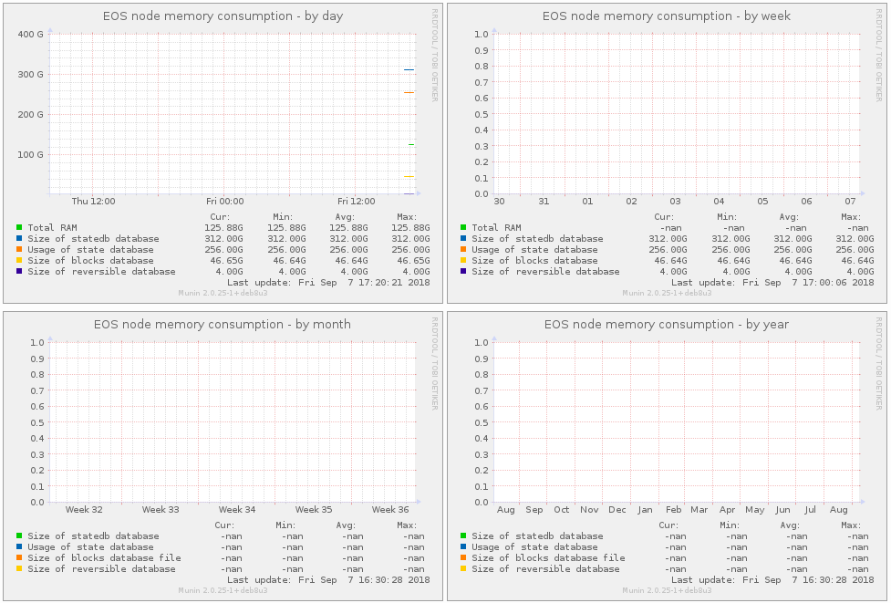

# eos-munin-plugin

### Munin plugin to monitor EOS node (state db, blocks db) memory consumption

##### List of plugins

#Eos balance
Liquid
Staked
Unstaking
Total

#Eos chain
Head block number
Last irreversible block number

#Eos cpu bandwidth
Staked
Delegated
Used
Available
Limit

#Eos mem
Total RAM  
Size of statedb database  
Usage of state database  
Size of blocks database  
Size of reversible database  

#Eos net bandwidth
Staked  
Delegated  
Used  
Available  
Limit  

#Eos quota
Quota  

##### Configuration:
echo "[eos_*]  
env.ACCOUNT eosaccount  
env.DATADIR /opt/EOSmainNet
" >> /etc/munin/plugin-conf.d/eosmem

...
where DATADIR path to your nodeos catalog with blocks and state catlogs

##### Usage: 
just place plugin in /usr/share/munin/plugins/eosmem

$ sudo chmod 755 /usr/share/munin/plugins/eosmem

$ sudo ln -s /usr/share/munin/plugins/eosmem /etc/munin/plugins/eosmem

$ sudo service munin-node restart
